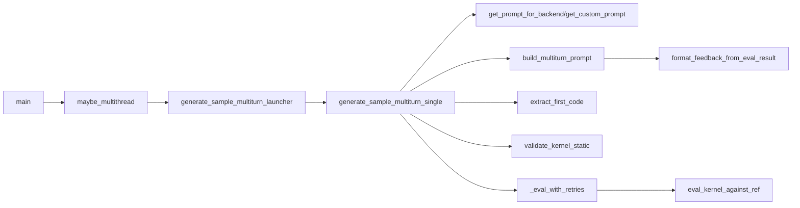

# KernelBench Scripts 使用指南

本文档详细列出了 `scripts/` 目录中所有 Python 脚本的使用方法和参数列表。

## 目录

- [评测分析脚本](#评测分析脚本)
- [代码生成脚本](#代码生成脚本)
- [评估脚本](#评估脚本)
- [基线测试脚本](#基线测试脚本)
- [调试和检查脚本](#调试和检查脚本)
- [验证脚本](#验证脚本)
- [CUDA 评估管道脚本](#cuda-评估管道脚本)

---

## 评测分析脚本

### benchmark_eval_analysis.py

分析模型在 KernelBench 上的性能表现，计算成功率、几何平均加速比和 Fast-p 分数。

**使用方法:**

```bash
python3 scripts/benchmark_eval_analysis.py run_name=<run_name> level=<level> hardware=<hardware> baseline=<baseline>
```

**参数列表:**

| 参数 | 类型 | 必需 | 描述 |
|------|------|------|------|
| `run_name` | str | 是 | 要评估的运行名称 |
| `level` | int/str | 是 | 评估的级别 (1-4 或 "level4_expand") |
| `hardware` | str | 是 | 硬件类型，对应 `results/timing/{hardware}/baseline.json` |
| `baseline` | str | 是 | 基线名称 |
| `baseline_file` | str | 否 | 基线 JSON 文件的覆盖路径 |
| `eval_results_dir` | str | 否 | 运行目录的覆盖路径 |
| `output_file` | str | 否 | 输出 JSON 结果文件路径 |

**示例:**

```bash
python3 scripts/benchmark_eval_analysis.py run_name=my_run level=1 hardware=L40S baseline=baseline_time_torch
```

---

### benchmark_eval_analysis_all_levels.py

一次计算**所有 level** 的统计，分别列出各 level 与 **Overall** 综合行，结果写入**一个 CSV 文件**。要求 `eval_results.json` 为多 level 格式（由 `eval_from_generations_all_levels.py` 生成）。

**使用方法:**

```bash
python3 scripts/benchmark_eval_analysis_all_levels.py run_name=<run_name> hardware=<hardware> baseline=<baseline>
```

**参数列表:**

| 参数 | 类型 | 必需 | 描述 |
|------|------|------|------|
| `run_name` | str | 是 | 运行名称（对应 runs/{run_name}/eval_results.json） |
| `hardware` | str | 是 | 硬件类型，对应 `results/timing/{hardware}/{baseline}.json` |
| `baseline` | str | 是 | 基线名称 |
| `eval_results_dir` | str | 否 | 覆盖 runs 目录路径 |
| `baseline_file` | str | 否 | 覆盖基线 JSON 路径 |
| `output_csv` | str | 否 | 输出 CSV 路径，默认 `runs/{run_name}/analysis_all_levels.csv` |

**输出:** 一个 CSV，列含 Level, TotalCount, CompiledCount, CorrectCount, CompilationRate, CorrectnessRate, GeoMeanSpeedup, Fast_p_0, Fast_p_0.5, Fast_p_0.8, Fast_p_1.0, Fast_p_1.5, Fast_p_2.0；行为各 level（level1～level4 等）及最后一行 Overall。

**示例:**

```bash
python3 scripts/benchmark_eval_analysis_all_levels.py run_name=my_run hardware=L40S baseline=baseline_time_torch
```

---

## 代码生成脚本

### generate_samples.py

批量生成指定级别的 KernelBench 问题样本。

**使用方法:**

```bash
python3 scripts/generate_samples.py dataset_src=<src> level=<level> run_name=<name> server_type=<type>
```

**参数列表:**

| 参数 | 类型 | 必需 | 默认值 | 描述 |
|------|------|------|--------|------|
| `dataset_src` | str | 是 | - | 数据源 ("huggingface" 或 "local") |
| `dataset_name` | str | 否 | "ScalingIntelligence/KernelBench" | HuggingFace 数据集名称 |
| `level` | int/str | 是 | - | 问题级别 (1-4 或 "level4_expand") |
| `subset` | tuple | 否 | (None, None) | 问题子集范围 (start_id, end_id) |
| `run_name` | str | 是 | - | 运行名称 |
| `num_workers` | int | 否 | 64 | 并行推理工作线程数 |
| `api_query_interval` | float | 否 | 0.0 | API 查询间隔（秒） |
| `server_type` | str | 否 | None | 服务器类型预设 |
| `model_name` | str | 否 | None | 模型名称 |
| `max_tokens` | int | 否 | None | 最大生成令牌数 |
| `temperature` | float | 否 | 0.0 | 采样温度 |
| `is_reasoning_model` | bool | 否 | False | 是否为推理模型 (o1, o3, Gemini 2.5 thinking 等) |
| `reasoning_effort` | str | 否 | "low" | 推理努力程度 ("low", "medium", "high") |
| `budget_tokens` | int | 否 | 0 | Claude 扩展思考模式的预算令牌 |
| `runs_dir` | str | 否 | "runs" | 运行目录 |
| `verbose` | bool | 否 | False | 详细日志 |
| `num_samples` | int | 否 | 1 | 每个问题的样本数 |
| `log_prompt` | bool | 否 | False | 记录提示词 |
| `backend` | str | 否 | "cuda" | 后端类型 ("cuda", "triton", "cute", "tilelang", "thunderkittens") |
| `precision` | str | 否 | "fp32" | 精度 ("fp32", "fp16", "bf16") |
| `prompt_option` | str | 否 | "one_shot" | 提示选项 ("zero_shot", "one_shot", "few_shot") |
| `include_hardware_info` | bool | 否 | False | 包含硬件信息 |
| `hardware_gpu_name` | str | 否 | None | 硬件 GPU 名称 |
| `custom_prompt_key` | str | 否 | None | 自定义提示键 |
| `check_kernel` | bool | 否 | True | 启用静态代码检查 |

**示例:**

```bash
python3 scripts/generate_samples.py dataset_src=huggingface level=1 run_name=my_run server_type=deepseek model_name=deepseek-chat
```

---

### generate_samples_all_levels.py

一次生成**所有 level**（1、2、3、4；可选 level4_expand）的算子，**无需指定 level 参数**。

**与 generate_samples.py 的区别：**

- 不传 `level`，脚本固定为 `level=all`，按 level 顺序依次生成（1 → 2 → 3 → 4，可选 level4_expand）。
- 支持 `include_level4_expand`（仅当 `dataset_src=local` 时有效）。
- 支持 **`problem_subset_file`**：只对指定文件中的题目生成 kernel；文件每行一个 `level_<level>_problem_<id>`（如 `level_level1_problem_1`、`level_level4_expand_problem_3`）。可与 `export_best_success.py --save_failed` 生成的 `failed_problem.txt` 配合，仅对“评测未通过”的题目重跑生成（见下方“仅对 failed 题目生成”示例）。
- 若 run 目录已存在且含 kernel，会询问是否 **resume**（跳过已生成、只补全未生成）；非交互环境下默认 resume。

**题目筛选优先级：** 若提供了 `problem_subset_file`，则只生成该文件中出现的 (level, problem_id)；否则若 `subset != (None, None)` 则按区间筛选；否则生成该 level 下全部题目。

**使用方法:**

```bash
python3 scripts/generate_samples_all_levels.py dataset_src=<src> run_name=<name> server_type=<type> [include_level4_expand=true] [problem_subset_file=<path>]
```

**参数列表:** 与 generate_samples.py 基本相同，额外/不同如下：

| 参数 | 类型 | 必需 | 默认值 | 描述 |
|------|------|------|--------|------|
| `level` | str | 否 | "all" | 本脚本固定为 "all"，不可指定单 level |
| `include_level4_expand` | bool | 否 | False | 是否包含 level4_expand（仅 dataset_src=local 时有效） |
| `problem_subset_file` | str | 否 | None | 仅生成该文件中的题目；每行格式 `level_<level>_problem_<id>` |

其余参数（dataset_src、run_name、subset、num_workers、server_type、model_name 等）与 generate_samples.py 一致。

**示例:**

```bash
# 生成 level 1～4
python3 scripts/generate_samples_all_levels.py dataset_src=huggingface run_name=my_run server_type=deepseek

# 本地数据源并包含 level4_expand
python3 scripts/generate_samples_all_levels.py dataset_src=local run_name=my_run server_type=deepseek include_level4_expand=true

# 仅对 failed_problem 列表中的题目生成（需先由 export_best_success.py 生成 failed_problem.txt，或使用 run_generate_failed_problem.sh）
python3 scripts/generate_samples_all_levels.py dataset_src=local run_name=retry_failed server_type=deepseek problem_subset_file=./best_success_out/failed_problem.txt
```

---

### generate_samples_multiturn_all_levels.py

参考 Kevin 论文（arXiv:2507.11948）提出的**多轮生成算子**流程：每个 (problem, sample) 会进行多轮迭代，按「生成 → 评估执行 → 反馈 → refine」循环若干轮（`max_turns`），并将上一轮的评估结果作为下一轮 prompt 的反馈上下文。该脚本同样支持一次生成所有 level，并支持 resume（已生成的 kernel 会被跳过）。

**使用方法:**

```bash
python3 scripts/generate_samples_multiturn_all_levels.py dataset_src=<src> run_name=<name> server_type=<type>
```

**新增参数（其余参数与 generate_samples_all_levels.py / generate_samples.py 一致）:**

| 参数 | 类型 | 必需 | 默认值 | 描述 |
|------|------|------|--------|------|
| `level` | str/int | 否 | "all" | 为 "all" 时跑全部 level；为 1/2/3/4 时**只跑该 level**（配合 subset 可只测一道题） |
| `max_turns` | int | 否 | 4 | 每个 (problem, sample) 的最大 refine 轮数 |
| `early_stop_on_correct` | bool | 否 | True | 若为 True，首次得到正确 kernel 即停止后续轮次 |

**说明:**

- **评估与反馈**：每轮会调用 `kernelbench.eval.eval_kernel_against_ref`（编译/运行/正确性/速度），并将结果格式化为反馈附加到下一轮 prompt（Kevin 风格 “previous attempts”）。
- **并行**：该脚本会在每个 worker 内串行执行一个 (problem, sample) 的多轮；由于编译与 GPU 评估较重，默认 `num_workers=1` 更稳（可自行调整）。
- **resume**：若 `runs/<run_name>/level_<level>_problem_<id>_sample_<sid>_kernel.py` 已存在，则跳过该项。

**输出文件（每个 problem/sample 一组）：**
- `level_<label>_problem_<id>_sample_<sid>_kernel.py`：最终采用的 kernel（最后一轮）。
- `level_<label>_problem_<id>_sample_<sid>_turn_<n>_kernel.py`：第 n 轮生成的 .py 脚本（n 从 0 开始）。
- `level_<label>_problem_<id>_sample_<sid>_conversation.json`：多轮对话与每轮性能。结构为 `messages`（system/user/assistant 交替）+ `turn_metrics`（每轮：`compiled`、`correctness`、`speedup`、`ref_runtime_us`、`runtime_us`、`error` 等）。

**流程图（脚本整体执行流程）:**

```mermaid
flowchart TD
  Start[Start] --> Main[main(config)]
  Main --> InitServer[create_inference_server_from_presets]
  Main --> LevelLoop[for_each_level_spec]
  LevelLoop --> BuildDataset[construct_kernelbench_dataset]
  BuildDataset --> BuildQueue[build_problems_to_run_skip_existing]
  BuildQueue --> ThreadPool[maybe_multithread]
  ThreadPool --> Launcher[generate_sample_multiturn_launcher]
  Launcher --> MultiTurn[generate_sample_multiturn_single]
  MultiTurn --> TurnLoop[for_turn_in_max_turns]
  TurnLoop --> Prompt[build_multiturn_prompt]
  Prompt --> Infer[inference_server(prompt)]
  Infer --> Extract[extract_first_code]
  Extract --> StaticCheck[validate_kernel_static]
  StaticCheck --> Eval[_eval_with_retries->eval_kernel_against_ref]
  Eval --> Feedback[format_feedback_from_eval_result]
  Feedback --> TurnLoop
  TurnLoop --> Save[write_final_kernel_py]
  Save --> Done[Done]
```

**方法调用关系（核心函数）:**



**示例:**

```bash
# 生成 level 1～4，多轮 refine（默认 max_turns=4）
python3 scripts/generate_samples_multiturn_all_levels.py dataset_src=huggingface run_name=my_run server_type=deepseek

# 更长的 refine 轮数
python3 scripts/generate_samples_multiturn_all_levels.py dataset_src=huggingface run_name=my_run server_type=deepseek max_turns=8

# 不提前停止（即使已经正确也继续尝试更快）
python3 scripts/generate_samples_multiturn_all_levels.py dataset_src=huggingface run_name=my_run server_type=deepseek early_stop_on_correct=False

# 只测一道题：仅 Level 1 的 problem 1，完成多轮后再结束（不跑 Level 2/3/4）
python3 scripts/generate_samples_multiturn_all_levels.py dataset_src=huggingface run_name=my_run server_type=deepseek level=1 subset="(1,1)"
```

---

### generate_samples_retry.py

仅对之前运行中失败或缺失的任务重新采样生成 kernel。

**使用方法:**

```bash
python3 scripts/generate_samples_retry.py retry_from_run=<run_name> dataset_src=<src> level=<level>
```

**参数列表:**

| 参数 | 类型 | 必需 | 默认值 | 描述 |
|------|------|------|--------|------|
| `retry_from_run` | str | 是 | - | 参考运行的 run_name |
| `run_name` | str | 否 | None | 新运行名称，默认为 `{retry_from_run}_retry` |
| `dataset_src` | str | 是 | - | 数据源 ("huggingface" 或 "local") |
| `dataset_name` | str | 否 | "ScalingIntelligence/KernelBench" | 数据集名称 |
| `level` | int/str | 否 | None | 级别，不填则从参考运行配置读取 |
| `subset` | tuple | 否 | (None, None) | 子集范围 |
| `num_samples` | int | 否 | None | 样本数，不填则从参考运行读取 |
| `num_workers` | int | 否 | 64 | 并行工作线程数 |
| `api_query_interval` | float | 否 | 0.0 | API 查询间隔 |
| `server_type` | str | 否 | None | 服务器类型 |
| `model_name` | str | 否 | None | 模型名称 |
| `max_tokens` | int | 否 | None | 最大令牌数 |
| `temperature` | float | 否 | 0.0 | 温度 |
| `is_reasoning_model` | bool | 否 | False | 推理模型标志 |
| `reasoning_effort` | str | 否 | "low" | 推理努力程度 |
| `budget_tokens` | int | 否 | 0 | 预算令牌 |
| `runs_dir` | str | 否 | "runs" | 运行目录 |
| `verbose` | bool | 否 | False | 详细日志 |
| `log_prompt` | bool | 否 | False | 记录提示词 |
| `backend` | str | 否 | "cuda" | 后端类型 |
| `precision` | str | 否 | "fp32" | 精度 |
| `prompt_option` | str | 否 | "one_shot" | 提示选项 |
| `include_hardware_info` | bool | 否 | False | 包含硬件信息 |
| `hardware_gpu_name` | str | 否 | None | GPU 名称 |
| `custom_prompt_key` | str | 否 | None | 自定义提示键 |
| `check_kernel` | bool | 否 | True | 启用静态检查 |

**示例:**

```bash
# 仅重跑 deepseek-chat 中失败/缺失的任务
python3 scripts/generate_samples_retry.py retry_from_run=deepseek-chat dataset_src=huggingface level=1 server_type=deepseek

# 指定新 run 目录并重跑
python3 scripts/generate_samples_retry.py retry_from_run=deepseek-chat run_name=deepseek-chat-retry2 dataset_src=huggingface level=1 server_type=deepseek
```

---

### generate_and_eval_single_sample.py

生成并评估单个样本，用于实验或调试。

**使用方法:**

```bash
python3 scripts/generate_and_eval_single_sample.py dataset_src=<src> level=<level> problem_id=<id> eval_mode=<mode> server_type=<type> model_name=<model>
```

**参数列表:**

| 参数 | 类型 | 必需 | 默认值 | 描述 |
|------|------|------|--------|------|
| `dataset_src` | str | 是 | - | 数据源 ("huggingface" 或 "local") |
| `dataset_name` | str | 否 | "ScalingIntelligence/KernelBench" | 数据集名称 |
| `level` | int | 是 | - | 问题级别 |
| `problem_id` | int | 是 | - | 问题 ID |
| `eval_mode` | str | 否 | "local" | 评估模式 ("local") |
| `gpu_arch` | list | 否 | ["Ada"] | GPU 架构 |
| `precision` | str | 否 | "fp32" | 精度 ("fp32", "fp16", "bf16") |
| `server_type` | str | 是 | - | 服务器类型 |
| `model_name` | str | 是 | - | 模型名称 |
| `max_tokens` | int | 否 | None | 最大令牌数 |
| `temperature` | float | 否 | None | 温度 |
| `is_reasoning_model` | bool | 否 | False | 推理模型标志 |
| `reasoning_effort` | str | 否 | None | 推理努力程度 |
| `budget_tokens` | int | 否 | 0 | 预算令牌 |
| `logdir` | str | 否 | "results/eval_logs" | 日志目录 |
| `verbose` | bool | 否 | False | 详细日志 |
| `log` | bool | 否 | False | 启用日志记录 |
| `log_prompt` | bool | 否 | False | 记录提示词 |
| `log_generated_kernel` | bool | 否 | False | 记录生成的 kernel |
| `log_eval_result` | bool | 否 | False | 记录评估结果 |
| `backend` | str | 否 | "cuda" | 后端类型 |
| `timing_method` | str | 否 | "cuda_event" | 计时方法 |
| `prompt_option` | str | 否 | "one_shot" | 提示选项 |
| `include_hardware_info` | bool | 否 | False | 包含硬件信息 |
| `hardware_gpu_name` | str | 否 | None | GPU 名称 |
| `custom_prompt_key` | str | 否 | None | 自定义提示键 |
| `check_kernel` | bool | 否 | True | 启用静态检查 |

**示例:**

```bash
python3 scripts/generate_and_eval_single_sample.py dataset_src=huggingface level=1 problem_id=1 eval_mode=local server_type=google model_name=gemini/gemini-2.5-flash max_tokens=8192 temperature=0.0
```

---

### generate_and_eval_single_sample_modal.py

使用 Modal 云 GPU 生成并评估单个样本。

**使用方法:**

```bash
uv run python scripts/generate_and_eval_single_sample_modal.py dataset_src=<src> level=<level> problem_id=<id> eval_mode=modal gpu=<gpu_type> server_type=<type> model_name=<model>
```

**参数列表:**

与 `generate_and_eval_single_sample.py` 基本相同，额外参数：

| 参数 | 类型 | 必需 | 默认值 | 描述 |
|------|------|------|--------|------|
| `gpu` | str | 否 | "L40S" | GPU 类型 ("L40S", "H100", "A100", "L4", "T4", "A10G") |
| `eval_mode` | str | 否 | "modal" | 评估模式 ("modal") |

**示例:**

```bash
uv run python scripts/generate_and_eval_single_sample_modal.py dataset_src=huggingface level=1 problem_id=1 eval_mode=modal gpu=L40S server_type=gemini model_name=gemini-2.5-flash max_tokens=4096 temperature=0.0
```

---

### generate_cuda_eval_code_from_runs.py

从运行结果生成 CUDA 评估代码（C++ 入口代码）。

**使用方法:**

```bash
python3 scripts/generate_cuda_eval_code_from_runs.py --run_name <name> --level <level>
# 或重新生成失败任务
python3 scripts/generate_cuda_eval_code_from_runs.py --run_name <name> --failed_results <path>
```

**参数列表:**

| 参数 | 类型 | 必需 | 默认值 | 描述 |
|------|------|------|--------|------|
| `--run_name` | str | 是 | - | 运行名称 |
| `--level` | str | 条件 | None | 处理的级别（未指定 --failed_results 时必填） |
| `--failed_results` | str | 否 | None | batch_test_results.txt 路径，仅重新生成失败任务 |

**示例:**

```bash
# 全量生成
python3 scripts/generate_cuda_eval_code_from_runs.py --run_name my_run --level 1

# 仅重新生成失败任务
python3 scripts/generate_cuda_eval_code_from_runs.py --run_name my_run --failed_results scripts/pipeline_reports/my_run/batch_test_results.txt
```

---

## 评估脚本

### eval_from_generations.py

从现有生成结果批量评估 kernel。

**使用方法:**

```bash
python3 scripts/eval_from_generations.py run_name=<name> dataset_src=<src> level=<level>
```

**参数列表:**

| 参数 | 类型 | 必需 | 默认值 | 描述 |
|------|------|------|--------|------|
| `run_name` | str | 是 | - | 运行名称 |
| `dataset_src` | str | 是 | - | 数据源 ("huggingface" 或 "local") |
| `dataset_name` | str | 否 | "ScalingIntelligence/KernelBench" | 数据集名称 |
| `level` | int/str | 是 | - | 问题级别 |
| `subset` | tuple | 否 | (None, None) | 子集范围 (start_id, end_id) |
| `problem_ids` | list | 否 | None | 特定问题 ID 列表 |
| `eval_mode` | str | 否 | "local" | 评估模式 ("local" 或 "modal") |
| `gpu` | str | 否 | "A10G" | Modal GPU 类型 |
| `gpu_arch` | list | 否 | ["Ada"] | GPU 架构 |
| `runs_dir` | str | 否 | "runs" | 运行目录 |
| `verbose` | bool | 否 | False | 详细日志 |
| `num_correct_trials` | int | 否 | 5 | 正确性试验次数 |
| `num_perf_trials` | int | 否 | 100 | 性能试验次数 |
| `timeout` | int | 否 | 180 | 超时（秒） |
| `measure_performance` | bool | 否 | True | 测量性能 |
| `timing_method` | str | 否 | "cuda_event" | 计时方法 |
| `build_cache` | bool | 否 | False | 启用编译缓存 |
| `num_cpu_workers` | int | 否 | 20 | CPU 编译工作线程数 |
| `kernel_eval_build_dir` | str | 否 | "cache" | kernel 评估构建目录 |
| `num_gpu_devices` | int | 否 | 1 | GPU 设备数 |
| `backend` | str | 否 | "cuda" | 后端类型 |
| `precision` | str | 否 | "fp32" | 精度 |
| `num_samples_per_problem` | int | 否 | 1 | 每个问题的样本数 |
| `pass_at_k_values` | list | 否 | [1] | pass@k 计算的 k 值 |

**示例:**

```bash
# 本地评估
python3 scripts/eval_from_generations.py run_name=my_run dataset_src=huggingface level=1

# Modal 评估
python3 scripts/eval_from_generations.py run_name=my_run dataset_src=huggingface level=1 eval_mode=modal gpu=L40S
```

---

### eval_from_generations_fix.py

`eval_from_generations.py` 的健壮版本，支持恢复、跳过已评估样本、错误不中断。

**使用方法:**

与 `eval_from_generations.py` 相同。

**额外特性:**
- 支持恢复：重新运行时会跳过已评估的样本
- 编译/运行时错误不会中断进程
- 跳过缺失的 kernel 并发出警告
- 修复了 `remove_cache_dir` 用于每个样本的缓存

---

### eval_from_generations_all_levels.py

一次评测**所有 level** 的算子，结果写入**同一个** `eval_results.json`，各 level 题目编号不冲突（顶层 key 为 level1、level2 等）。与 `eval_from_generations_fix.py` 的区别：无需指定 level，按 level 循环评测并写入多 level 格式；build_dir 含 level_key 避免跨 level 缓存冲突。**仅支持 eval_mode=local**，不支持 Modal。

**使用方法:**

```bash
python3 scripts/eval_from_generations_all_levels.py run_name=<name> dataset_src=<src>
```

**参数列表:** 与 `eval_from_generations_fix.py` 基本相同，但：

| 参数 | 类型 | 必需 | 默认值 | 描述 |
|------|------|------|--------|------|
| `level` | str | 否 | "all" | 本脚本固定为 "all" |
| `include_level4_expand` | bool | 否 | False | 是否包含 level4_expand（仅 dataset_src=local） |

**示例:**

```bash
python3 scripts/eval_from_generations_all_levels.py run_name=my_run dataset_src=huggingface
```

---

### run_and_check.py

运行一对 KernelBench 格式的问题和解决方案，检查正确性并计算加速比。

**使用方法:**

```bash
# 本地文件评估
python3 scripts/run_and_check.py ref_origin=local ref_arch_src_path=<path> kernel_src_path=<path> eval_mode=local

# KernelBench 问题评估
python3 scripts/run_and_check.py ref_origin=kernelbench level=<level> problem_id=<id> kernel_src_path=<path> eval_mode=local

# Modal 评估
python3 scripts/run_and_check.py ref_origin=local ref_arch_src_path=<path> kernel_src_path=<path> eval_mode=modal gpu=H100
```

**参数列表:**

| 参数 | 类型 | 必需 | 默认值 | 描述 |
|------|------|------|--------|------|
| `ref_origin` | str | 是 | - | 参考来源 ("local" 或 "kernelbench") |
| `ref_arch_src_path` | str | 条件 | - | 本地参考架构文件路径（ref_origin=local 时必填） |
| `dataset_src` | str | 否 | "huggingface" | 数据源 |
| `dataset_name` | str | 否 | "ScalingIntelligence/KernelBench" | 数据集名称 |
| `level` | str | 条件 | - | 级别（ref_origin=kernelbench 时必填） |
| `problem_id` | str | 条件 | - | 问题 ID（ref_origin=kernelbench 时必填） |
| `kernel_src_path` | str | 是 | - | kernel 源文件路径 |
| `eval_mode` | str | 否 | "local" | 评估模式 ("local" 或 "modal") |
| `gpu` | str | 否 | "L40S" | Modal GPU 类型 |
| `num_correct_trials` | int | 否 | 5 | 正确性试验次数 |
| `num_perf_trials` | int | 否 | 100 | 性能试验次数 |
| `timeout` | int | 否 | 300 | 超时（秒） |
| `verbose` | bool | 否 | False | 详细日志 |
| `measure_performance` | bool | 否 | True | 测量性能 |
| `timing_method` | str | 否 | "cuda_event" | 计时方法 |
| `build_dir_prefix` | str | 否 | "" | 构建目录前缀 |
| `clear_cache` | bool | 否 | False | 清除缓存 |
| `gpu_arch` | list | 否 | ["Ada"] | GPU 架构 |
| `precision` | str | 否 | "fp32" | 精度 |
| `backend` | str | 否 | "cuda" | 后端类型 |
| `check_kernel` | bool | 否 | True | 启用静态检查 |

**示例:**

```bash
python3 scripts/run_and_check.py ref_origin=local ref_arch_src_path=src/kernelbench/prompts/model_ex_add.py kernel_src_path=src/kernelbench/prompts/model_new_ex_add.py eval_mode=local
```

---

## 基线测试脚本

### generate_baseline_time.py

生成 KernelBench 的基线时间（本地执行）。

**功能:**
测量参考架构的执行时间，支持多种 PyTorch 配置：
- Torch Eager（默认）
- Torch Compile（Inductor backend，多种模式）
- Torch Compile（cudagraphs backend）

**使用方法:**

直接修改脚本中的 `hardware_name` 变量并运行：

```bash
python3 scripts/generate_baseline_time.py
```

**主要函数参数:**

| 参数 | 类型 | 默认值 | 描述 |
|------|------|--------|------|
| `use_torch_compile` | bool | False | 是否使用 torch.compile |
| `torch_compile_backend` | str | "inductor" | 编译后端 |
| `torch_compile_options` | str | "default" | 编译选项 |
| `file_name` | str | "baseline_time.json" | 输出文件名 |
| `precision` | str | "fp32" | 精度 |

---

### generate_baseline_time_modal.py

使用 Modal 云 GPU 生成基线时间。

**使用方法:**

```bash
python3 scripts/generate_baseline_time_modal.py level=<level> gpu=<gpu> hardware_name=<name>
```

**参数列表:**

| 参数 | 类型 | 必需 | 默认值 | 描述 |
|------|------|------|--------|------|
| `level` | int | 是 | - | 问题级别 |
| `gpu` | str | 是 | - | GPU 类型 ("L40S", "H100", "A100", "A100-80GB", "L4", "T4", "A10G") |
| `hardware_name` | str | 是 | - | 硬件名称（用于保存结果） |
| `num_gpu_devices` | int | 否 | 8 | 并行 GPU 容器数 |
| `timeout` | int | 否 | 1800 | 每批超时（秒） |
| `num_trials` | int | 否 | 100 | 计时试验次数 |
| `precision` | str | 否 | "fp32" | 精度 |

**示例:**

```bash
python3 scripts/generate_baseline_time_modal.py level=1 gpu=L40S hardware_name=L40S_baseline
```

---

### generate_baseline_time_resume.py

支持恢复功能的基线时间生成脚本。

**使用方法:**

```bash
python3 scripts/generate_baseline_time_resume.py --hardware_name <name> [--num_gpus <n>] [--precision <p>] [--timeout <t>] [--levels <l...>]
```

**参数列表:**

| 参数 | 类型 | 必需 | 默认值 | 描述 |
|------|------|------|--------|------|
| `--num_gpus` | int | 否 | 1 | 并行测量 GPU 数 |
| `--hardware_name` | str | 否 | "H200" | 硬件名称 |
| `--precision` | str | 否 | "fp32" | 精度 ("fp32", "fp16", "bf16") |
| `--timeout` | int | 否 | 0 | 每操作超时（秒），0 表示无超时 |
| `--levels` | list | 否 | None | 要测量的级别（如 `--levels 1 2 4` 或 `--levels 1 2 level4_expand`） |

**示例:**

```bash
# 测量所有级别
python3 scripts/generate_baseline_time_resume.py --hardware_name H200 --num_gpus 4 --precision bf16

# 仅测量特定级别
python3 scripts/generate_baseline_time_resume.py --hardware_name H200 --num_gpus 4 --levels 1 2 4
```

---

### get_baseline_time_single_problem.py

测试单个问题的基线时间测量。

**使用方法:**

直接运行，修改脚本中的 `ref_arch_name` 和 `ref_arch_src`：

```bash
python3 scripts/get_baseline_time_single_problem.py
```

---

## 调试和检查脚本

### debug_stddout.py

测试是否能捕获 NVCC 编译错误。

**使用方法:**

```bash
python3 scripts/debug_stddout.py
```

**说明:**
测试正确和错误的 kernel 代码的编译捕获功能。

---

### inspect_baseline.py

检查 PyTorch 基线生成的 Triton 代码。

**使用方法:**

```bash
python3 scripts/inspect_baseline.py
```

**主要函数:**

| 函数 | 描述 |
|------|------|
| `inspect_torch_compile(fn, inputs, output_dir, filename)` | 检查 torch.compile 的 Dynamo 追踪、融合决策和生成代码 |
| `inspect_baseline_torch_compile(level_num, problem_id)` | 获取特定问题的 torch.compile Triton 代码 |

---

### inspect_kernel_pytorch_profiler.py

使用 PyTorch Profiler 检查 kernel 的算子和 kernel 分解。

**主要函数:**

```python
def get_torch_profiler_info(
    ref_arch_src: str,
    kernel_src: str,
    build_dir: str,
    device: torch.device,
    num_trials: int = 100,
    table_row_limit: int = 10,
    seed_num: int = 42
) -> str
```

**参数:**

| 参数 | 类型 | 默认值 | 描述 |
|------|------|--------|------|
| `ref_arch_src` | str | - | 参考架构源代码 |
| `kernel_src` | str | - | kernel 源代码 |
| `build_dir` | str | - | 构建目录 |
| `device` | torch.device | - | 运行设备 |
| `num_trials` | int | 100 | 分析试验次数 |
| `table_row_limit` | int | 10 | 表格行数限制 |
| `seed_num` | int | 42 | 随机种子 |

---

### inspect_triton.py

检查 torch.compile 生成的 Triton 代码，并生成火焰图。

**主要函数:**

| 函数 | 描述 |
|------|------|
| `run_profile_and_save_trace(dataset, problem_id, num_trials)` | 运行分析并保存 trace 文件 |
| `get_torch_compile_triton(level_num, problem_id)` | 获取 torch.compile 生成的 Triton 代码 |

---

## 验证脚本

### verify_bench.py

测试 KernelBench 中模型的正确性。

**使用方法:**

```bash
python3 scripts/verify_bench.py
```

**说明:**
验证参考架构的编译正确性和确定性（相同输入产生相同输出）。

---

### verify_generation.py

测试推理并快速迭代提示词。

**使用方法:**

```bash
python3 scripts/verify_generation.py [arch_path]
```

**参数:**

| 参数 | 类型 | 默认值 | 描述 |
|------|------|--------|------|
| `arch_path` (命令行) | str | "./KernelBench/level1/1_Square_matrix_multiplication_.py" | 架构文件路径 |

---

### verify_level4_extend_precision.py

验证 level4_extend 展开实现与 level4 原始实现的精度对齐。

**使用方法:**

```bash
# 测试所有 GPT-2 文件
python3 scripts/verify_level4_extend_precision.py

# 仅测试特定问题
python3 scripts/verify_level4_extend_precision.py --problem 16

# 使用 CPU
python3 scripts/verify_level4_extend_precision.py --device cpu
```

**参数列表:**

| 参数 | 类型 | 必需 | 默认值 | 描述 |
|------|------|------|--------|------|
| `--problem` | int | 否 | None | 指定 problem id (7, 16, 19)，不指定则测试全部 |
| `--device` | str | 否 | "cuda"/"cpu" | 运行设备 |
| `--atol` | float | 否 | 1e-4 | 绝对误差容限 |
| `--rtol` | float | 否 | 1e-4 | 相对误差容限 |

**注意:** Problem 19 (batch_size=1024) 在 CPU 上可能因内存不足被终止。

---

## CUDA 评估管道脚本

### cuda_eval_pipeline.py

**用途概述**

本脚本是一条「生成 → 转 C++ CUDA → 编译运行 → 纠错重试」的流水线，主要做三件事：

1. **任务来源**：从 `runs/<run_name>` 里读取**已通过 PyTorch 侧评测**的 kernel（或从失败结果文件指定题目），对应 `runs/<run_name>/level_<level>_problem_<id>_sample_0_kernel.py`。
2. **转成可评测的 C++ CUDA 工程**：用 **LiteLLM** 调用大模型，根据 kernel 的宏、`__global__` 和 `torch::Tensor` 入口，生成符合 kernelbench 约定的**纯 C++ CUDA 入口**（如 `test_tmp_kernel_ori(...)`），不包含 torch/pybind；再写入 `cuda_optim/kernelbench/<namespace>/`，并生成 `tmp_test.cu` 做 ori/opt 对比与计时。
3. **本地编译 + GPU 运行 + 迭代修错**：用 `nvcc` 编译、在 GPU 上跑测试，从 stdout 解析 `<precision>`、`<runtime_ratio>` 等；若编译或运行失败，把错误信息反馈给 LLM 重生成，最多重试 `--max_iter` 次。

因此，它把「runs 里已通过的 PyTorch kernel」变成「可在 kernelbench 风格 C++ 环境里评测正确性与加速比」的流程，并支持用 LLM 自动修编译/运行错误。

**数据流与目录约定**

- **输入**：`runs/<run_name>/`（kernel 源文件，以及可选的 `eval_results.json` 用于筛「已通过」题目）；可选 `--failed_results` 指定一个结果文件，只处理其中标记为 COMPILE_ERROR / RUNTIME_ERROR / TIMEOUT 的 level+problem。
- **输出**：`cuda_eval_code/<run_name>/`（每个任务生成的 C++ 入口）；`cuda_optim/kernelbench/<namespace>/`（按 kernelbench 目录结构展开的工程）；`--report_dir` 下 `pipeline_reports/<run_name>_<timestamp>/`（报告、日志、checkpoint、以及可选的 LLM 对话 trace）。

题目元信息（problem 名称等）从 `KernelBench/`（`KERNELBENCH_META_ROOT`）读取；`common.h` 可从 `--common_h` 指定，不指定则从 `cuda_optim/kernelbench/` 下已有任务自动检测。

**任务收集逻辑**

- **未指定 `--failed_results`**：读取 `runs/<run_name>/eval_results.json`（若存在），对 `--level` 中的每个 level 只保留**已编译通过且 correctness 为 True** 的 problem（sample_id=0）；若加 `--skip_eval_check` 则不做这层过滤，按 level 全量跑。
- **指定 `--failed_results`**：解析该文件中的 `level(\d+)_(\d+)_` 及 COMPILE_ERROR/RUNTIME_ERROR/TIMEOUT 等行，得到「level → problem_id 列表」，只对这些失败题跑流水线。

**单任务流水线（概要）**

对每个 pending 任务：从 run 目录抽取 kernel 的 macro / `__global__` / 入口 → 用 LLM 生成 C++ CUDA 入口 → 后处理（去掉 torch/pybind、统一 `__global__` 等）→ 写入 cuda_eval_code 与 kernelbench 工程 → 可选再调 LLM 解决 ori/opt/check 命名冲突 → 生成 `tmp_test.cu` → `nvcc` 编译 → 在 GPU 上运行 → 解析 `<precision>`、`<runtime_ratio>`；失败则把错误写入 prompt 重试，直到成功或达到 `--max_iter`。报告与 checkpoint 会保存每次 attempt、日志路径、precision、runtime_ratio 等，便于排查和 `--resume`。

**使用方法:**

```bash
python3 scripts/cuda_eval_pipeline.py --run_name <name> --model <model> [options]
```

**常用参数:**

| 参数 | 类型 | 必需 | 默认值 | 描述 |
|------|------|------|--------|------|
| `--run_name` | str | 是 | - | 运行名称（runs 下的 run 目录名） |
| `--model` | str | 是 | - | LiteLLM 的 model 名（如 openai/xxx、claude-3-5-sonnet 等） |
| `--level` | str | 否 | "1,2,3,4,level4_expand" | 要跑的 level，逗号分隔 |
| `--failed_results` | str | 否 | None | 仅处理该文件中列出的失败题（按 level+problem 解析） |
| `--skip_eval_check` | bool | 否 | False | 不依赖 eval_results 过滤，按 level 全量跑 |
| `--max_iter` | int | 否 | 10 | 每个任务最多用 LLM 重试的次数 |
| `--parallel_gen` / `--compile_workers` | int | 否 | 4 / CPU//2 | 并行任务数与编译并发 |
| `--num_gpus` | int | 否 | 0 | 用于跑 binary 的 GPU 数，0 表示自动检测 |
| `--nvcc_arch` | str | 否 | "sm_89" | nvcc 的 -arch |
| `--timeout` | int | 否 | 120 | 单次运行 binary 的超时（秒） |
| `--report_dir` | str | 否 | "scripts/pipeline_reports" | 报告根目录；具体报告在 `<report_dir>/<run_name>_<timestamp>/` |
| `--resume` | str | 否 | "" | 从已有报告目录恢复（读 checkpoint.json 或 pipeline_report.json） |
| `--common_h` | str | 否 | "" | common.h 路径；空则自动从 kernelbench 任务里找 |
| `--kernelbench_namespace` | str | 否 | "" | `cuda_optim/kernelbench/` 下的子目录；空则从 run_name 推导 |
| `--llm_trace_subdir` / `--disable_llm_trace` | str/bool | 否 | "llm_traces" / False | 是否保存每个任务的 LLM 请求/响应 trace |
| `--api_timeout` | int | 否 | 120 | LLM API 请求超时（秒） |
| `--api_key` | str | 否 | None | API 密钥（也可通过环境变量） |

**依赖与运行**

- 需要 **LiteLLM**（`pip install litellm`），用于调用各类 LLM API。
- 需要 **nvcc** 和可用 GPU，以便编译并运行生成的 C++ CUDA 测试。
- 建议在项目根目录执行。

**示例:**

```bash
# 全新运行（level 1、2）
python3 scripts/cuda_eval_pipeline.py --run_name my_cuda_run --model anthropic/claude-sonnet-4 --level 1,2

# 恢复运行
python3 scripts/cuda_eval_pipeline.py --run_name my_cuda_run --model anthropic/claude-sonnet-4 --resume scripts/pipeline_reports/my_cuda_run_20240115_120000

# 仅处理失败任务
python3 scripts/cuda_eval_pipeline.py --run_name my_cuda_run --model anthropic/claude-sonnet-4 --failed_results scripts/pipeline_reports/my_cuda_run/batch_test_results.txt
```

---

## 后端支持

以下脚本支持多种后端：

| 后端 | 说明 | 支持的脚本 |
|------|------|-----------|
| `cuda` | CUDA C++ | 全部 |
| `triton` | Triton | generate_samples, generate_and_eval_single_sample, eval_from_generations |
| `tilelang` | TileLang | generate_samples, generate_and_eval_single_sample |
| `cute` | CuTe | generate_samples, generate_and_eval_single_sample |
| `thunderkittens` | ThunderKittens | generate_samples, generate_and_eval_single_sample |

---

## 精度支持

| 精度 | 说明 |
|------|------|
| `fp32` | 单精度浮点（默认） |
| `fp16` | 半精度浮点 |
| `bf16` | BFloat16 |

**注意:**
- `tilelang` 后端自动使用 `fp16`
- `thunderkittens` 后端自动使用 `bf16` 和 H100 GPU

---

## 环境变量

部分脚本使用以下环境变量：

| 变量 | 说明 | 使用脚本 |
|------|------|---------|
| `ANTHROPIC_API_KEY` | Anthropic API 密钥 | generate_cuda_eval_code_from_runs |
| `OPENAI_API_KEY` | OpenAI API 密钥 | 多个脚本（通过 litellm） |
| `DEEPSEEK_API_KEY` | DeepSeek API 密钥 | 多个脚本 |
| `GEMINI_API_KEY` | Gemini API 密钥 | 多个脚本 |
| `THUNDERKITTENS_ROOT` | ThunderKittens 安装路径 | Modal 相关脚本 |
